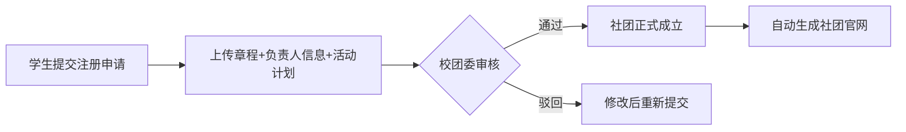
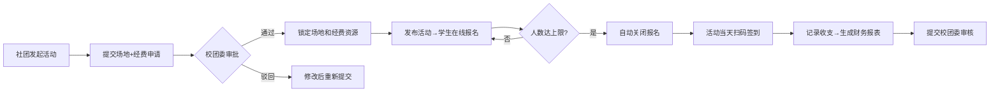
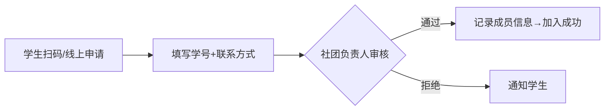

## 1. 产品概述

高校学生社团与俱乐部管理平台，面向高校社团管理全流程，解决社团注册审批、成员管理、活动组织、经费核算、官网展示等核心痛点。

- 主要目的：实现校团委、社团负责人、普通学生三方协同的数字化管理，提升社团运营效率和透明度
- 目标用户：校团委管理员、社团负责人、在校学生
- 产品价值：打通社团从注册到评优的完整生命周期，实现无纸化管理、数据可追溯、对外展示一体化

## 2. 核心 Features

### 2.1 User Roles

| 角色 | 注册方式 | 核心权限 |
|------|----------|----------|
| 校团委管理员 | 系统内置账号 | 社团注册审批、活动审批、经费审核、评优管理、数据统计 |
| 社团负责人 | 学生注册后创建社团申请 | 社团信息维护、成员审核、活动发起、经费记录、签到管理、工作总结提交 |
| 普通学生 | 学号注册/认证 | 浏览社团、扫码加入社团、活动报名、签到、查看个人参与记录 |

### 2.2 Feature Module

1. **登录/注册页**：角色选择、学号认证、登录入口
2. **校团委管理后台**：社团审批中心、活动审批中心、经费审核中心、评优管理、数据看板
3. **社团负责人工作台**：社团信息维护、成员管理、活动管理、经费管理、官网编辑、工作总结
4. **学生主页**：社团广场、活动大厅、我的社团、个人中心
5. **社团官网主页**（对外）：社团介绍、成员展示、近期活动、动态资讯
6. **活动详情页**：活动信息、报名入口、签到二维码、出席记录

### 2.3 Page Details

| 页面名称 | 模块名称 | 功能描述 |
|----------|----------|----------|
| 登录/注册页 | 角色切换 | 学生/管理员角色切换、学号输入、密码登录 |
| 登录/注册页 | 学生认证 | 学号格式校验、学校邮箱验证 |
| 校团委管理后台 | 社团审批列表 | 待审批/已通过/已拒绝社团列表、查看详情、一键审批/驳回 |
| 校团委管理后台 | 活动审批中心 | 场地申请审核、经费申请审核、资源锁定状态 |
| 校团委管理后台 | 经费审核中心 | 收支记录汇总、财务报表审核、一键通过 |
| 校团委管理后台 | 数据看板 | 社团总数、活跃社团数、活动数量统计、经费使用趋势图 |
| 社团负责人工作台 | 社团信息维护 | 社团章程上传、负责人信息、简介编辑 |
| 社团负责人工作台 | 成员管理 | 扫码申请列表、审核通过/拒绝、成员通讯录、学号和联系方式 |
| 社团负责人工作台 | 活动管理 | 新建活动（场地+经费申请）、活动发布、报名管理、签到二维码、出席记录 |
| 社团负责人工作台 | 经费管理 | 收支记录录入、分类统计、自动生成财务报表、提交审核 |
| 社团负责人工作台 | 工作总结 | 学年总结提交、材料上传、评优自评 |
| 学生主页 | 社团广场 | 所有社团卡片列表、分类筛选、搜索、查看详情 |
| 学生主页 | 活动大厅 | 近期活动时间轴、报名入口、已满员标识 |
| 学生主页 | 我的社团 | 已加入社团列表、待审核申请、签到记录 |
| 学生主页 | 个人中心 | 个人信息、联系方式、学号、参与统计 |
| 社团官网主页 | Hero 横幅 | 社团名称、Logo、Slogan、动态背景 |
| 社团官网主页 | 社团介绍 | 关于我们、章程摘要、负责人信息 |
| 社团官网主页 | 成员展示 | 核心成员卡片、负责人头像 |
| 社团官网主页 | 近期活动 | 活动时间轴卡片、报名按钮 |
| 社团官网主页 | 动态资讯 | 活动回顾、新闻公告列表 |
| 活动详情页 | 活动信息 | 标题、时间、地点、主办方、人数上限、已报名人数 |
| 活动详情页 | 报名入口 | 在线报名、人数达上限自动关闭、取消报名 |
| 活动详情页 | 签到模块 | 活动当天展示二维码、扫码签到 |

## 3. Core Process

### 社团注册审批流程
学生发起社团注册申请，提交社团章程、负责人信息、活动计划，校团委管理员审核，通过后社团正式成立，自动生成官网主页。

### 活动组织全流程
社团负责人发起活动，提交场地和经费申请，校团委审批通过后锁定资源，发布活动供学生报名，活动当天扫码签到，活动结束后记录收支并生成报表。

### 成员加入流程
学生扫描社团二维码或在社团广场申请加入，社团负责人审核通过后记录学号和联系方式，成员正式加入。

## 4. User Interface Design

### 4.1 Design Style

- **主色**：院校蓝 `#1e3a8a`（沉稳、学术感），搭配活力橙 `#f97316` 作为强调色（青春、活力）
- **辅助色**：浅灰蓝 `#f0f4ff` 背景、翡翠绿 `#10b981` 表示通过/成功、玫红 `#ef4444` 表示拒绝/警告
- **按钮风格**：圆润胶囊型按钮（圆角-full），主按钮渐变蓝，悬停上浮效果
- **字体**：标题使用 Noto Serif SC（衬线体，学术气质），正文使用 PingFang SC / Microsoft YaHei
- **布局风格**：卡片式布局 + 侧边栏导航，数据看板采用网格仪表盘布局
- **图标风格**：线性图标（Lucide Icons），色彩克制，线条粗细统一

### 4.2 Page Design Overview

| 页面名称 | 模块名称 | UI Elements |
|----------|----------|-------------|
| 登录/注册页 | 登录卡片 | 半透明玻璃拟态卡片、左侧院校插画背景、渐变按钮、表单微动效 |
| 校团委管理后台 | 数据看板 | 顶部 4 个统计卡片、中部图表（折线+柱状）、底部审批列表、卡片悬浮投影 |
| 社团负责人工作台 | 侧边导航 | 深色侧栏、图标+文字、激活项高亮、右侧主内容区分模块卡片 |
| 社团官网主页 | Hero 横幅 | 全屏宽度、渐变蒙版、社团名称大号衬线字体、Slogan 淡入动画 |
| 社团官网主页 | 成员展示 | 圆形头像卡片、悬浮显示姓名职位、交错淡入动画 |
| 学生主页 | 社团广场 | 瀑布流卡片、封面图+标签+成员数、悬浮放大微交互 |
| 活动详情页 | 签到模块 | 居中大二维码、倒计时提示、绿色签到成功动画反馈 |

### 4.3 Responsiveness

- Desktop-first 设计，主断点 1024px / 768px
- 桌面端：侧边栏 + 主内容区双栏布局
- 平板端：侧边栏收起为图标栏，内容区自适应
- 移动端：顶部汉堡菜单、卡片单列、底部 Tab 导航
- 触屏优化：按钮最小触控区 44px，签到二维码自适应屏幕宽度
