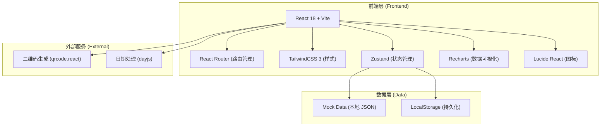
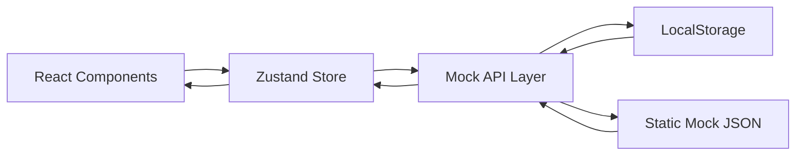
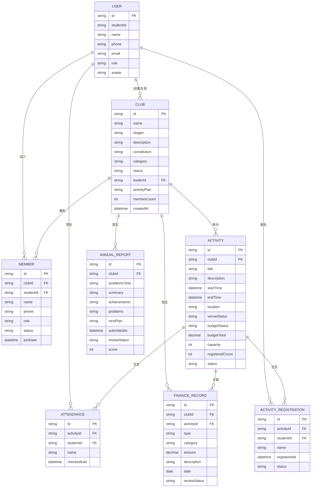

## 1. Architecture Design



## 2. Technology Description

- **前端框架**：React@18.2.0 + TypeScript
- **构建工具**：Vite@5
- **样式方案**：TailwindCSS@3.4 + PostCSS + Autoprefixer
- **路由**：React Router DOM@6
- **状态管理**：Zustand@4（轻量级，适合中小型应用）
- **UI 组件**：自定义组件 + TailwindCSS，不引入重型 UI 库
- **数据可视化**：Recharts@2
- **图标库**：Lucide React
- **日期处理**：dayjs
- **二维码**：qrcode.react
- **数据方案**：前端 Mock 数据 + LocalStorage 持久化（无后端）
- **代码规范**：ESLint + Prettier

## 3. Route Definitions

| Route | Purpose |
|-------|---------|
| `/login` | 登录/注册页，角色选择 |
| `/admin/dashboard` | 校团委管理后台 - 数据看板 |
| `/admin/clubs` | 校团委 - 社团审批列表 |
| `/admin/clubs/:id` | 校团委 - 社团审批详情 |
| `/admin/activities` | 校团委 - 活动审批中心 |
| `/admin/activities/:id` | 校团委 - 活动审批详情 |
| `/admin/finances` | 校团委 - 经费审核中心 |
| `/admin/reviews` | 校团委 - 评优管理 |
| `/leader/dashboard` | 社团负责人 - 工作台首页 |
| `/leader/club` | 社团负责人 - 社团信息维护 |
| `/leader/members` | 社团负责人 - 成员管理 |
| `/leader/activities` | 社团负责人 - 活动列表 |
| `/leader/activities/new` | 社团负责人 - 创建活动 |
| `/leader/activities/:id` | 社团负责人 - 活动管理详情（含签到） |
| `/leader/finances` | 社团负责人 - 经费管理 |
| `/leader/report` | 社团负责人 - 学年工作总结 |
| `/student/home` | 学生主页 - 社团广场 |
| `/student/activities` | 学生 - 活动大厅 |
| `/student/my` | 学生 - 我的社团 |
| `/student/profile` | 学生 - 个人中心 |
| `/club/:clubId` | 社团官网主页（对外展示） |
| `/activity/:activityId` | 活动详情页（报名+签到） |

## 4. API Definitions（Mock 接口定义）

```typescript
// 用户类型
interface User {
  id: string;
  studentId: string;
  name: string;
  phone: string;
  email: string;
  role: 'admin' | 'leader' | 'student';
  avatar?: string;
  department?: string;
}

// 社团类型
interface Club {
  id: string;
  name: string;
  logo?: string;
  slogan: string;
  description: string;
  constitution: string;
  category: string;
  status: 'pending' | 'approved' | 'rejected';
  leaderId: string;
  leaderInfo: {
    name: string;
    studentId: string;
    phone: string;
  };
  activityPlan: string;
  memberCount: number;
  createdAt: string;
  approvedAt?: string;
}

// 成员类型
interface Member {
  id: string;
  clubId: string;
  studentId: string;
  name: string;
  phone: string;
  joinDate: string;
  status: 'pending' | 'approved' | 'rejected';
  role: 'member' | 'vice_leader' | 'leader';
}

// 活动类型
interface Activity {
  id: string;
  clubId: string;
  title: string;
  description: string;
  cover?: string;
  startTime: string;
  endTime: string;
  location: string;
  venueApplication: {
    venue: string;
    timeSlot: string;
    status: 'pending' | 'approved' | 'rejected';
  };
  budgetApplication: {
    total: number;
    items: { name: string; amount: number; remark?: string }[];
    status: 'pending' | 'approved' | 'rejected';
  };
  capacity: number;
  registeredCount: number;
  status: 'draft' | 'pending' | 'approved' | 'published' | 'ended';
  registrations: ActivityRegistration[];
  attendances: Attendance[];
}

// 活动报名
interface ActivityRegistration {
  id: string;
  activityId: string;
  studentId: string;
  name: string;
  registeredAt: string;
  status: 'registered' | 'cancelled';
}

// 签到记录
interface Attendance {
  id: string;
  activityId: string;
  studentId: string;
  name: string;
  checkedInAt: string;
}

// 财务记录
interface FinanceRecord {
  id: string;
  clubId: string;
  activityId?: string;
  type: 'income' | 'expense';
  category: string;
  amount: number;
  description: string;
  date: string;
  reviewer?: string;
  reviewStatus: 'pending' | 'approved' | 'rejected';
}

// 工作总结
interface AnnualReport {
  id: string;
  clubId: string;
  academicYear: string;
  summary: string;
  achievements: string;
  problems: string;
  nextPlan: string;
  submittedAt: string;
  reviewStatus: 'pending' | 'approved' | 'rejected';
  score?: number;
}

// Mock API 方法签名
interface ApiService {
  login(studentId: string, password: string): Promise<User>;
  getClubs(status?: string): Promise<Club[]>;
  approveClub(clubId: string): Promise<void>;
  rejectClub(clubId: string, reason: string): Promise<void>;
  getMembers(clubId: string): Promise<Member[]>;
  approveMember(memberId: string): Promise<void>;
  getActivities(clubId?: string, status?: string): Promise<Activity[]>;
  createActivity(data: Partial<Activity>): Promise<Activity>;
  approveActivity(activityId: string): Promise<void>;
  registerActivity(activityId: string): Promise<void>;
  checkIn(activityId: string, studentId: string): Promise<void>;
  getFinanceRecords(clubId: string): Promise<FinanceRecord[]>;
  addFinanceRecord(data: Partial<FinanceRecord>): Promise<FinanceRecord>;
  submitAnnualReport(data: Partial<AnnualReport>): Promise<AnnualReport>;
}
```

## 5. Server Architecture Diagram（无后端，前端数据流向）



## 6. Data Model

### 6.1 Data Model Definition



### 6.2 Data Definition Language（Mock 数据初始化说明）

```typescript
// 初始 Mock 数据（存入 localStorage 的 key）
const STORAGE_KEYS = {
  USERS: 'club_users',
  CLUBS: 'club_list',
  MEMBERS: 'club_members',
  ACTIVITIES: 'club_activities',
  FINANCES: 'club_finances',
  REPORTS: 'club_reports',
  CURRENT_USER: 'current_user',
};

// 初始种子数据（首次加载时写入 localStorage）
const seedData = {
  users: [
    {
      id: 'admin_001',
      studentId: 'admin',
      name: '校团委管理员',
      phone: '010-12345678',
      email: 'tuanwei@university.edu.cn',
      role: 'admin',
      avatar: '',
    },
    {
      id: 'leader_001',
      studentId: '2023001001',
      name: '张三',
      phone: '13800138001',
      email: 'zhangsan@mail.edu.cn',
      role: 'leader',
      department: '计算机学院',
    },
    {
      id: 'student_001',
      studentId: '2023002001',
      name: '李四',
      phone: '13800138002',
      email: 'lisi@mail.edu.cn',
      role: 'student',
      department: '文学院',
    },
  ],
  clubs: [
    {
      id: 'club_001',
      name: '创新科技协会',
      slogan: '科技改变世界，创新引领未来',
      description: '致力于科技创新实践，组织机器人、AI、物联网等方向的技术交流和竞赛活动。',
      constitution: '第一章 总则...',
      category: '科技类',
      status: 'approved',
      leaderId: 'leader_001',
      leaderInfo: { name: '张三', studentId: '2023001001', phone: '13800138001' },
      activityPlan: '每两周一次技术分享会，每学期一次大型科技竞赛',
      memberCount: 86,
      createdAt: '2024-09-01',
      approvedAt: '2024-09-10',
    },
  ],
};
```
